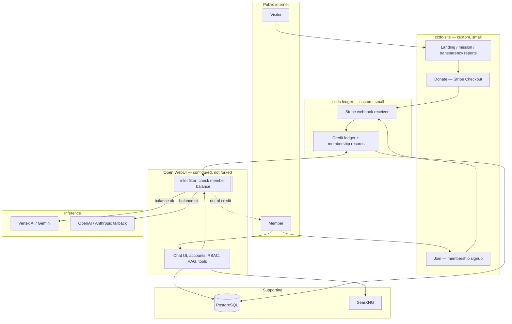

# MVP architecture and build order

## Principle

Configure Open WebUI; don't fork it. Every custom line we write is a line we
maintain forever and a line that makes upstream upgrades harder. The three
custom components below are deliberately small and sit *beside* Open WebUI, not
inside it.

## Shape

## The three things we build

### 1. `ccdc-site` — public website

Static or near-static. Astro, plain HTML, or a small Next.js app; the choice
does not matter and should not be argued about.

Pages: mission, who we are, the board, **the transparency report**, donate,
join, and a link to the chat app. The transparency report is not a nice-to-have
— it is the product differentiator (doc 05).

Donations via **Stripe Checkout** (hosted page). Do not build a card form; do
not touch PAN data; do not put yourself in PCI scope for a nonprofit's first
year.

**Effort: ~1 week.**

### 2. `ccdc-ledger` — membership and credit service

Owns the answer to "is this person a member in good standing, and how much
compute do they have left this period?" This must live outside Open WebUI
because it is the governance system of record (doc 05), and because Open WebUI
has no concept of either (doc 01).

Responsibilities:

- receive Stripe webhooks (`checkout.session.completed`,
  `customer.subscription.*`) and record dues and donations
- maintain member records: joined, dues paid through, voting eligibility
- maintain a **credit ledger**: allocation granted per period, consumption
  debited, balance
- expose a small internal API the inlet filter calls
- reconcile consumption against Open WebUI's `/analytics/users` token counts

**Effort: ~2 weeks.**

### 3. The inlet filter — ~100 lines

An Open WebUI *filter function* (Python, installed through the admin UI, no
fork) with an `inlet` hook. `utils/middleware.py` invokes `filter_type='inlet'`
on every request before it reaches the model **[code]**. The filter:

1. reads the user id from the request
2. asks `ccdc-ledger` for the balance
3. raises with a friendly message if the member is out of allocation
4. otherwise passes through, and reports consumption on the way out (`outlet`)

This is the enforcement point for "a flat share of the AI output." Without it,
allocation is a promise, not a mechanism.

**Effort: ~3 days.** Worth upstreaming (doc 02).

## Everything else is configuration

| Need | How |
|---|---|
| Accounts, login | Open WebUI native, or OIDC later |
| Approve new members | `DEFAULT_USER_ROLE=pending` **[code]** — new signups wait for approval; the ledger flips them to `user` when dues clear |
| Membership tiers | Open WebUI groups + per-model access grants **[code]** — expensive models restricted to a group |
| Web search | Self-hosted SearXNG, not Gemini grounding (doc 03 — grounding costs ~2× a whole chat turn) |
| Usage measurement | `/analytics/users`, `/analytics/tokens` **[code]** |
| Branding | `WEBUI_NAME="El Paso Community AI"` → renders with the "(Open WebUI)" suffix; keep it (doc 02) |
| File storage | Local disk at MVP; GCS when you outgrow one VM **[docs]** |

## Build order

**Phase 0 — prove it (a weekend).** One VM, `docker compose up` Open WebUI +
Postgres, point it at Vertex AI Gemini, invite ten people you know. No
payments, no ledger, no site. The goal is to have something to show a
prospective board member, and to find out whether anyone actually wants this.
Under 50 users, so branding is unrestricted and the license question is moot.

**Phase 1 — make it real (~3 weeks).** `ccdc-site` + Stripe + the pending→user
approval flow. Now you can accept donations. If the entity is not formed yet,
donations are **not tax-deductible** and you must say so plainly on the page
(doc 05 covers the fiscal-sponsorship bridge that fixes this).

**Phase 2 — make it sustainable (~2 weeks).** `ccdc-ledger` + the inlet
filter. **Do not open public signups before this exists.** Unbounded spend
against a donated budget is how this fails in month two, and "we ran out of
money because we didn't meter it" is precisely the kind of unkept-promise story
the organization exists to be the opposite of.

**Phase 3 — make it accountable (ongoing).** The transparency report: publish
the cloud billing export, token spend by model, cost per member, and the
energy/water figures from the provider. Automate it so it publishes whether or
not anyone remembers to.

**Phase 4 — governance.** Member elections, board seats, bylaws in force. This
is doc 05 and it is not a software phase.

## Deliberate non-goals for the MVP

- Own GPUs. The economics are bad until thousands of members (doc 03).
- Mobile apps. The web app is a PWA; that is enough.
- Custom chat UI. Open WebUI's is better than what we would build.
- Fine-tuned or locally-trained models. Later, or never.
- Multi-region, HA, Kubernetes. One VM until one VM demonstrably hurts.
